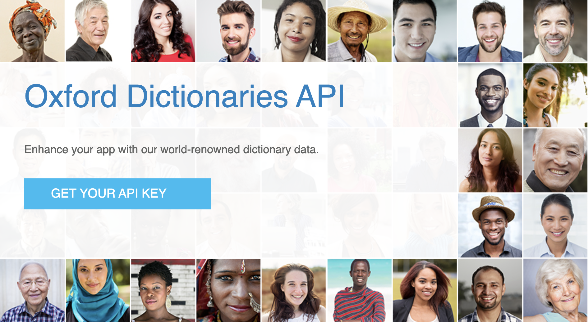

<div align="left">

[](https://developer.oxforddictionaries.com)

# Oxford dictionaries<a id="oxford-dictionaries"></a>

Oxford Dictionaries, part of the Oxford Language Division, is a leading authority on the English language. It offers a wide range of language resources, including dictionaries, thesauruses, grammar guides, and language learning tools. Oxford Dictionaries provides accurate and up-to-date definitions, word origins, and usage examples to support language comprehension and communication.


</div>

## Table of Contents<a id="table-of-contents"></a>

<!-- toc -->

- [Requirements](#requirements)
- [Installation](#installation)
- [Getting Started](#getting-started)
- [Async](#async)
- [Raw HTTP Response](#raw-http-response)
- [Reference](#reference)
  * [`oxforddictionaries.dictionary_entries.apply_filters`](#oxforddictionariesdictionary_entriesapply_filters)
  * [`oxforddictionaries.dictionary_entries.get_information`](#oxforddictionariesdictionary_entriesget_information)
  * [`oxforddictionaries.dictionary_entries.specify_dictionary_region`](#oxforddictionariesdictionary_entriesspecify_dictionary_region)
  * [`oxforddictionaries.lemmatron.check_and_retrieve_root_form`](#oxforddictionarieslemmatroncheck_and_retrieve_root_form)
  * [`oxforddictionaries.lexi_stats.get_ngram_frequencies`](#oxforddictionarieslexi_statsget_ngram_frequencies)
  * [`oxforddictionaries.lexi_stats.get_word_frequencies`](#oxforddictionarieslexi_statsget_word_frequencies)
  * [`oxforddictionaries.lexi_stats.get_word_frequency`](#oxforddictionarieslexi_statsget_word_frequency)
  * [`oxforddictionaries.search.get_matches`](#oxforddictionariessearchget_matches)
  * [`oxforddictionaries.search.possible_translations`](#oxforddictionariessearchpossible_translations)
  * [`oxforddictionaries.the_sentence_dictionary.get_corpus_sentences`](#oxforddictionariesthe_sentence_dictionaryget_corpus_sentences)
  * [`oxforddictionaries.thesaurus.get_antonyms`](#oxforddictionariesthesaurusget_antonyms)
  * [`oxforddictionaries.thesaurus.get_similar_words`](#oxforddictionariesthesaurusget_similar_words)
  * [`oxforddictionaries.thesaurus.get_synonyms_antonyms`](#oxforddictionariesthesaurusget_synonyms_antonyms)
  * [`oxforddictionaries.translation.get_word_translation`](#oxforddictionariestranslationget_word_translation)
  * [`oxforddictionaries.utility.get_grammatical_features`](#oxforddictionariesutilityget_grammatical_features)
  * [`oxforddictionaries.utility.get_lexical_categories`](#oxforddictionariesutilityget_lexical_categories)
  * [`oxforddictionaries.utility.list_available_domains`](#oxforddictionariesutilitylist_available_domains)
  * [`oxforddictionaries.utility.list_available_filters`](#oxforddictionariesutilitylist_available_filters)
  * [`oxforddictionaries.utility.list_available_languages`](#oxforddictionariesutilitylist_available_languages)
  * [`oxforddictionaries.utility.list_bilingual_registers`](#oxforddictionariesutilitylist_bilingual_registers)
  * [`oxforddictionaries.utility.list_endpoint_filters`](#oxforddictionariesutilitylist_endpoint_filters)
  * [`oxforddictionaries.utility.list_monolingual_domains`](#oxforddictionariesutilitylist_monolingual_domains)
  * [`oxforddictionaries.utility.list_monolingual_regions`](#oxforddictionariesutilitylist_monolingual_regions)
  * [`oxforddictionaries.utility.list_monolingual_registers`](#oxforddictionariesutilitylist_monolingual_registers)
  * [`oxforddictionaries.wordlist.get_advanced_words`](#oxforddictionarieswordlistget_advanced_words)
  * [`oxforddictionaries.wordlist.get_category_words`](#oxforddictionarieswordlistget_category_words)

<!-- tocstop -->

## Requirements<a id="requirements"></a>

Python >=3.7

## Installation<a id="installation"></a>
<div align="center">
  <a href="https://konfigthis.com/sdk-sign-up?company=Oxford%20Dictionaries&language=Python">
    
  </a>
</div>

## Getting Started<a id="getting-started"></a>

```python
from pprint import pprint
from oxford_dictionaries_python_sdk import OxfordDictionaries, ApiException

oxforddictionaries = OxfordDictionaries(
    app_id="YOUR_API_KEY",
    app_key="YOUR_API_KEY",
)

try:
    # Apply filters to response
    apply_filters_response = oxforddictionaries.dictionary_entries.apply_filters(
        source_lang="en",
        word_id="ace",
        filters=["grammaticalFeatures=singular,past;lexicalCategory=noun"],
    )
    print(apply_filters_response)
except ApiException as e:
    print("Exception when calling DictionaryEntriesApi.apply_filters: %s\n" % e)
    pprint(e.body)
    pprint(e.headers)
    pprint(e.status)
    pprint(e.reason)
    pprint(e.round_trip_time)
```

## Async<a id="async"></a>

`async` support is available by prepending `a` to any method.

```python
import asyncio
from pprint import pprint
from oxford_dictionaries_python_sdk import OxfordDictionaries, ApiException

oxforddictionaries = OxfordDictionaries(
    app_id="YOUR_API_KEY",
    app_key="YOUR_API_KEY",
)


async def main():
    try:
        # Apply filters to response
        apply_filters_response = (
            await oxforddictionaries.dictionary_entries.aapply_filters(
                source_lang="en",
                word_id="ace",
                filters=["grammaticalFeatures=singular,past;lexicalCategory=noun"],
            )
        )
        print(apply_filters_response)
    except ApiException as e:
        print("Exception when calling DictionaryEntriesApi.apply_filters: %s\n" % e)
        pprint(e.body)
        pprint(e.headers)
        pprint(e.status)
        pprint(e.reason)
        pprint(e.round_trip_time)


asyncio.run(main())
```

## Raw HTTP Response<a id="raw-http-response"></a>

To access raw HTTP response values, use the `.raw` namespace.

```python
from pprint import pprint
from oxford_dictionaries_python_sdk import OxfordDictionaries, ApiException

oxforddictionaries = OxfordDictionaries(
    app_id="YOUR_API_KEY",
    app_key="YOUR_API_KEY",
)

try:
    # Apply filters to response
    apply_filters_response = oxforddictionaries.dictionary_entries.raw.apply_filters(
        source_lang="en",
        word_id="ace",
        filters=["grammaticalFeatures=singular,past;lexicalCategory=noun"],
    )
    pprint(apply_filters_response.body)
    pprint(apply_filters_response.body["metadata"])
    pprint(apply_filters_response.body["results"])
    pprint(apply_filters_response.headers)
    pprint(apply_filters_response.status)
    pprint(apply_filters_response.round_trip_time)
except ApiException as e:
    print("Exception when calling DictionaryEntriesApi.apply_filters: %s\n" % e)
    pprint(e.body)
    pprint(e.headers)
    pprint(e.status)
    pprint(e.reason)
    pprint(e.round_trip_time)
```


## Reference<a id="reference"></a>
### `oxforddictionaries.dictionary_entries.apply_filters`<a id="oxforddictionariesdictionary_entriesapply_filters"></a>


Use filters to limit the [entry](documentation/glossary?term=entry) information that is returned. For example, you may only require definitions and not everything else, or just [pronunciations](documentation/glossary?term=pronunciation). The full list of filters can be retrieved from the filters Utility endpoint. You can also specify values within the filter using '='. For example 'grammaticalFeatures=singular'. Filters can also be combined using a semicolon.

  <div id="dictionary_entries_filters"></div>


#### 🛠️ Usage<a id="🛠️-usage"></a>

```python
apply_filters_response = oxforddictionaries.dictionary_entries.apply_filters(
    source_lang="en",
    word_id="ace",
    filters=["grammaticalFeatures=singular,past;lexicalCategory=noun"],
)
```

#### ⚙️ Parameters<a id="⚙️-parameters"></a>

##### source_lang: `str`<a id="source_lang-str"></a>

IANA language code

##### word_id: `str`<a id="word_id-str"></a>

An Entry identifier. Case-sensitive.

##### filters: List[`str`]<a id="filters-liststr"></a>

Separate filtering conditions using a semicolon. Conditions take values grammaticalFeatures and/or lexicalCategory and are case-sensitive. To list multiple values in single condition divide them with comma.

#### 🔄 Return<a id="🔄-return"></a>

[`RetrieveEntry`](./oxford_dictionaries_python_sdk/pydantic/retrieve_entry.py)

#### 🌐 Endpoint<a id="🌐-endpoint"></a>

`/entries/{source_lang}/{word_id}/{filters}` `get`

[🔙 **Back to Table of Contents**](#table-of-contents)

---

### `oxforddictionaries.dictionary_entries.get_information`<a id="oxforddictionariesdictionary_entriesget_information"></a>


Use this to retrieve definitions, [pronunciations](documentation/glossary?term=pronunciation), example sentences, [grammatical information](documentation/glossary?term=grammaticalfeatures) and [word origins](documentation/glossary?term=etymology). It only works for dictionary [headwords](documentation/glossary?term=headword), so you may need to use the [Lemmatron](documentation/glossary?term=lemma) first if your input is likely to be an [inflected](documentation/glossary?term=inflection) form (e.g., 'swimming'). This would return the linked [headword](documentation/glossary?term=headword) (e.g., 'swim') which you can then use in the Entries endpoint. Unless specified using a region filter, the default lookup will be the Oxford Dictionary of English (GB). 
  <div id="dictionary_entries"></div>


#### 🛠️ Usage<a id="🛠️-usage"></a>

```python
get_information_response = oxforddictionaries.dictionary_entries.get_information(
    source_lang="en",
    word_id="ace",
)
```

#### ⚙️ Parameters<a id="⚙️-parameters"></a>

##### source_lang: `str`<a id="source_lang-str"></a>

IANA language code

##### word_id: `str`<a id="word_id-str"></a>

An Entry identifier. Case-sensitive.

#### 🔄 Return<a id="🔄-return"></a>

[`RetrieveEntry`](./oxford_dictionaries_python_sdk/pydantic/retrieve_entry.py)

#### 🌐 Endpoint<a id="🌐-endpoint"></a>

`/entries/{source_lang}/{word_id}` `get`

[🔙 **Back to Table of Contents**](#table-of-contents)

---

### `oxforddictionaries.dictionary_entries.specify_dictionary_region`<a id="oxforddictionariesdictionary_entriesspecify_dictionary_region"></a>


USe this filter to restrict the lookup to either our Oxford Dictionary of English (GB) or New Oxford American Dictionary (US).


#### 🛠️ Usage<a id="🛠️-usage"></a>

```python
specify_dictionary_region_response = (
    oxforddictionaries.dictionary_entries.specify_dictionary_region(
        source_lang="en",
        word_id="ace",
        region="gb",
    )
)
```

#### ⚙️ Parameters<a id="⚙️-parameters"></a>

##### source_lang: `str`<a id="source_lang-str"></a>

IANA language code

##### word_id: `str`<a id="word_id-str"></a>

An Entry identifier. Case-sensitive.

##### region: `str`<a id="region-str"></a>

Region filter parameter. gb = Oxford Dictionary of English. us = New Oxford American Dictionary.

#### 🔄 Return<a id="🔄-return"></a>

[`RetrieveEntry`](./oxford_dictionaries_python_sdk/pydantic/retrieve_entry.py)

#### 🌐 Endpoint<a id="🌐-endpoint"></a>

`/entries/{source_lang}/{word_id}/regions&#x3D;{region}` `get`

[🔙 **Back to Table of Contents**](#table-of-contents)

---

### `oxforddictionaries.lemmatron.check_and_retrieve_root_form`<a id="oxforddictionarieslemmatroncheck_and_retrieve_root_form"></a>


Use this to check if a word exists in the dictionary, or what 'root' form it links to (e.g., swimming > swim). The response tells you the possible [lemmas](documentation/glossary?term=lemma) for a given [inflected](documentation/glossary?term=inflection) word. This can then be combined with other endpoints to retrieve more information.

  <div id="lemmatron"></div>


#### 🛠️ Usage<a id="🛠️-usage"></a>

```python
check_and_retrieve_root_form_response = (
    oxforddictionaries.lemmatron.check_and_retrieve_root_form(
        source_lang="en",
        filters=["grammaticalFeatures=singular,past;lexicalCategory=noun"],
        word_id="swimming",
    )
)
```

#### ⚙️ Parameters<a id="⚙️-parameters"></a>

##### source_lang: `str`<a id="source_lang-str"></a>

IANA language code

##### filters: List[`str`]<a id="filters-liststr"></a>

Separate filtering conditions using a semicolon. Conditions take values grammaticalFeatures and/or lexicalCategory and are case-sensitive. To list multiple values in single condition divide them with comma.

##### word_id: `str`<a id="word_id-str"></a>

The input word

#### 🔄 Return<a id="🔄-return"></a>

[`Lemmatron`](./oxford_dictionaries_python_sdk/pydantic/lemmatron.py)

#### 🌐 Endpoint<a id="🌐-endpoint"></a>

`/inflections/{source_lang}/{word_id}/{filters}` `get`

[🔙 **Back to Table of Contents**](#table-of-contents)

---

### `oxforddictionaries.lexi_stats.get_ngram_frequencies`<a id="oxforddictionarieslexi_statsget_ngram_frequencies"></a>

This endpoint returns frequencies of ngrams of size 1-4. That is the number of times a word (ngram size = 1) or words (ngram size > 1) appear in the corpus. Ngrams are case sensitive ("I AM" and "I am" will have different frequency) and frequencies are calculated per word (true case) so "the book" and "the books" are two different ngrams. The results can be filtered based on query parameters. <br> <br> Parameters can be provided in PATH, GET or POST (form or json). The parameters in PATH are overridden by parameters in GET, POST and json (in that order). In PATH, individual options are separated by semicolon and values are separated by commas (where multiple values can be used). <br> <br> Example for bigrams (ngram of size 2):
* PATH: /tokens=a word,another word
* GET: /?tokens=a word&tokens=another word
* POST (json):

  ```javascript
    {
        "tokens": ["a word", "another word"]
    }
  ```

Either "tokens" or "contains" has to be provided. <br> <br> Some queries with "contains" or "sort" can exceed the 30s timeout, in which case the API will return an error message with status code 503. You mitigate this by providing additional restrictions such as "minFrequency" and "maxFrequency". <br> <br> You can use the parameters "offset" and "limit" to paginate through large result sets. For convenience, the HTTP header "Link" is set on the response to provide links to "first", "self", "next", "prev" and "last" pages of results (depending on the context). For example, if the result set contains 50 results and the parameter "limit" is set to 25, the Links header will contain an URL for the first 25 results and the next 25 results. <br> <br> Some libraries such as python's `requests` can parse the header automatically and offer a convenient way of iterating through the results. For example:
```python def get_all_results(url):
    while url:
        r = requests.get(url)
        r.raise_for_status()
        for item in r.json()['results']:
          yield item
        url = r.links.get('next', {}).get('url')
```


#### 🛠️ Usage<a id="🛠️-usage"></a>

```python
get_ngram_frequencies_response = oxforddictionaries.lexi_stats.get_ngram_frequencies(
    source_lang="en",
    corpus="nmc",
    ngram_size="2",
    tokens="a word",
    contains="string_example",
    punctuation="string_example",
    format="oup",
    min_frequency=1,
    max_frequency=1,
    min_document_frequency=1,
    max_document_frequency=1,
    collate="string_example",
    sort="string_example",
    offset=0,
    limit=100,
)
```

#### ⚙️ Parameters<a id="⚙️-parameters"></a>

##### source_lang: `str`<a id="source_lang-str"></a>

IANA language code

##### corpus: `str`<a id="corpus-str"></a>

For corpora other than 'nmc' (New Monitor Corpus) please contact api@oxforddictionaries.com

##### ngram_size: `str`<a id="ngram_size-str"></a>

the size of ngrams requested (1-4)

##### tokens: `str`<a id="tokens-str"></a>

List of tokens to filter. The tokens are separated by spaces, the list items are separated by comma (e.g., for bigrams (n=2) tokens=this is,this was, this will)

##### contains: `str`<a id="contains-str"></a>

Find ngrams containing the given token(s). Use comma or space as token separators; the order of tokens is irrelevant.

##### punctuation: `str`<a id="punctuation-str"></a>

Flag specifying whether to lookup ngrams that include punctuation or not (possible values are \"true\" and \"false\"; default is \"false\")

##### format: `str`<a id="format-str"></a>

Option specifying whether tokens should be returned as a single string (option \"google\") or as a list of strings (option \"oup\")

##### min_frequency: `int`<a id="min_frequency-int"></a>

Restrict the query to entries with frequency of at least `minFrequency`

##### max_frequency: `int`<a id="max_frequency-int"></a>

Restrict the query to entries with frequency of at most `maxFrequency`

##### min_document_frequency: `int`<a id="min_document_frequency-int"></a>

Restrict the query to entries that appear in at least `minDocumentFrequency` documents

##### max_document_frequency: `int`<a id="max_document_frequency-int"></a>

Restrict the query to entries that appera in at most `maxDocumentFrequency` documents

##### collate: `str`<a id="collate-str"></a>

collate the results by wordform, trueCase, lemma, lexicalCategory. Multiple values can be separated by commas (e.g., collate=trueCase,lemma,lexicalCategory).

##### sort: `str`<a id="sort-str"></a>

sort the resulting list by wordform, trueCase, lemma, lexicalCategory, frequency, normalizedFrequency. Descending order is achieved by prepending the value with the minus sign ('-'). Multiple values can be separated by commas (e.g., sort=lexicalCategory,-frequency)

##### offset: `int`<a id="offset-int"></a>

pagination - results offset

##### limit: `int`<a id="limit-int"></a>

pagination - results limit

#### 🔄 Return<a id="🔄-return"></a>

[`NgramsResult`](./oxford_dictionaries_python_sdk/pydantic/ngrams_result.py)

#### 🌐 Endpoint<a id="🌐-endpoint"></a>

`/stats/frequency/ngrams/{source_lang}/{corpus}/{ngram-size}` `get`

[🔙 **Back to Table of Contents**](#table-of-contents)

---

### `oxforddictionaries.lexi_stats.get_word_frequencies`<a id="oxforddictionarieslexi_statsget_word_frequencies"></a>

This endpoint provides a list of frequencies for a given word or words. Unlike the /word/ endpoint, the results are split into the smallest units. <br> <br> To exclude a specific value, prepend it with the minus sign ('-'). For example, to get frequencies of the lemma 'happy' but exclude superlative forms (i.e., happiest) you could use options 'lemma=happy;grammaticalFeatures=-degreeType:superlative'. <br> <br> Parameters can be provided in PATH, GET or POST (form or json). The parameters in PATH are overridden by parameters in GET, POST and json (in that order). In PATH, individual options are separated by semicolon and values are separated by commas (where multiple values can be used). <br> <br> The parameters wordform/trueCase/lemma/lexicalCategory also exist in a plural form, taking a lists of items. Examples:
* PATH: /wordforms=happy,happier,happiest
* GET: /?wordforms=happy&wordforms=happier&wordforms=happiest
* POST (json):
```javascript
  {
    "wordforms": ["happy", "happier", "happiest"]
  }
```
A mor complex example of retrieving frequencies of multiple lemmas:
```
  {
      "lemmas": ["happy", "content", "cheerful", "cheery", "merry", "joyful", "ecstatic"],
      "grammaticalFeatures": {
          "adjectiveFunctionType": "predicative"
      },
      "lexicalCategory": "adjective",
      "sort": ["lemma", "-frequency"]
  }
```
Some queries with "collate" or "sort" can exceed the 30s timeout, in which case the API will return an error message with status code 503. You mitigate this by providing additional restrictions such as "minFrequency" and "maxFrequency". <br> <br> You can use the parameters "offset" and "limit" to paginate through large result sets. For convenience, the HTTP header "Link" is set on the response to provide links to "first", "self", "next", "prev" and "last" pages of results (depending on the context). For example, if the result set contains 50 results and the parameter "limit" is set to 25, the Links header will contain an URL for the first 25 results and the next 25 results. <br> <br> Some libraries such as python's `requests` can parse the header automatically and offer a convenient way of iterating through the results. For example:
```python def get_all_results(url):
    while url:
        r = requests.get(url)
        r.raise_for_status()
        for item in r.json()['results']:
          yield item
        url = r.links.get('next', {}).get('url')
```


#### 🛠️ Usage<a id="🛠️-usage"></a>

```python
get_word_frequencies_response = oxforddictionaries.lexi_stats.get_word_frequencies(
    source_lang="en",
    corpus="nmc",
    wordform="string_example",
    true_case="string_example",
    lemma="test",
    lexical_category="string_example",
    grammatical_features="string_example",
    sort="string_example",
    collate="string_example",
    min_frequency=1,
    max_frequency=1,
    min_normalized_frequency=3.14,
    max_normalized_frequency=3.14,
    offset=0,
    limit=100,
)
```

#### ⚙️ Parameters<a id="⚙️-parameters"></a>

##### source_lang: `str`<a id="source_lang-str"></a>

IANA language code

##### corpus: `str`<a id="corpus-str"></a>

For corpora other than 'nmc' (New Monitor Corpus) please contact api@oxforddictionaries.com

##### wordform: `str`<a id="wordform-str"></a>

The written form of the word to look up (preserving case e.g., Book vs book)

##### true_case: `str`<a id="true_case-str"></a>

The written form of the word to look up with normalised case (Books --> books)

##### lemma: `str`<a id="lemma-str"></a>

The lemma of the word to look up (e.g., Book, booked, books all have the lemma \"book\")

##### lexical_category: `str`<a id="lexical_category-str"></a>

The lexical category of the word(s) to look up (e.g., adjective or noun)

##### grammatical_features: `str`<a id="grammatical_features-str"></a>

The grammatical features of the word(s) to look up entered as a list of k:v (e.g., degree_type:comparative)

##### sort: `str`<a id="sort-str"></a>

sort the resulting list by wordform, trueCase, lemma, lexicalCategory, frequency, normalizedFrequency. Descending order is achieved by prepending the value with the minus sign ('-'). Multiple values can be separated by commas (e.g., sort=lexicalCategory,-frequency)

##### collate: `str`<a id="collate-str"></a>

collate the results by wordform, trueCase, lemma, lexicalCategory. Multiple values can be separated by commas (e.g., collate=trueCase,lemma,lexicalCategory).

##### min_frequency: `int`<a id="min_frequency-int"></a>

Restrict the query to entries with frequency of at least `minFrequency`

##### max_frequency: `int`<a id="max_frequency-int"></a>

Restrict the query to entries with frequency of at most `maxFrequency`

##### min_normalized_frequency: `Union[int, float]`<a id="min_normalized_frequency-unionint-float"></a>

Restrict the query to entries with frequency of at least `minNormalizedFrequency`

##### max_normalized_frequency: `Union[int, float]`<a id="max_normalized_frequency-unionint-float"></a>

Restrict the query to entries with frequency of at most `maxNormalizedFrequency`

##### offset: `int`<a id="offset-int"></a>

pagination - results offset

##### limit: `int`<a id="limit-int"></a>

pagination - results limit

#### 🔄 Return<a id="🔄-return"></a>

[`StatsWordResultList`](./oxford_dictionaries_python_sdk/pydantic/stats_word_result_list.py)

#### 🌐 Endpoint<a id="🌐-endpoint"></a>

`/stats/frequency/words/{source_lang}` `get`

[🔙 **Back to Table of Contents**](#table-of-contents)

---

### `oxforddictionaries.lexi_stats.get_word_frequency`<a id="oxforddictionarieslexi_statsget_word_frequency"></a>

This endpoint provides the frequency of a given word. When multiple database records match the query parameters, the returned frequency is the sum of the individual frequencies. For example, if the query parameters are lemma=test, the returned frequency will include the verb "test", the noun "test" and the adjective "test" in all forms (Test, tested, testing, etc.) <br> <br> If you are interested in the frequency of the word "test" but want to exclude other forms (e.g., tested) use the option trueCase=test. Normally, the word "test" will be spelt with a capital letter at the beginning of a sentence. The option trueCase will ignore this and it will count "Test" and "test" as the same token. If you are interested in frequencies of "Test" and "test", use the option wordform=test or wordform=Test. Note that trueCase is not just a lower case of the word as some words are genuinely spelt with a capital letter such as the word "press" in Oxford University Press. <br> <br> Parameters can be provided in PATH, GET or POST (form or json). The parameters in PATH are overriden by parameters in GET, POST and json (in that order). In PATH, individual options are separated by semicolon and values are separated by commas (where multiple values can be used). Examples:
* PATH: /lemma=test;lexicalCategory=noun
* GET: /?lemma=test&lexicalCategory=noun
* POST (json):

  ```javascript
    {
      "lemma": "test",
      "lexicalCategory": "noun"
    }
  ```

<br> One of the options wordform/trueCase/lemma/lexicalCategory has to be provided.


#### 🛠️ Usage<a id="🛠️-usage"></a>

```python
get_word_frequency_response = oxforddictionaries.lexi_stats.get_word_frequency(
    source_lang="en",
    corpus="nmc",
    wordform="string_example",
    true_case="string_example",
    lemma="test",
    lexical_category="string_example",
)
```

#### ⚙️ Parameters<a id="⚙️-parameters"></a>

##### source_lang: `str`<a id="source_lang-str"></a>

IANA language code

##### corpus: `str`<a id="corpus-str"></a>

For corpora other than 'nmc' (New Monitor Corpus) please contact api@oxforddictionaries.com

##### wordform: `str`<a id="wordform-str"></a>

The written form of the word to look up (preserving case e.g., Books vs books)

##### true_case: `str`<a id="true_case-str"></a>

The written form of the word to look up with normalised case (Books --> books)

##### lemma: `str`<a id="lemma-str"></a>

The lemma of the word to look up (e.g., Book, booked, books all have the lemma \"book\")

##### lexical_category: `str`<a id="lexical_category-str"></a>

The lexical category of the word(s) to look up (e.g., noun or verb)

#### 🔄 Return<a id="🔄-return"></a>

[`StatsWordResult`](./oxford_dictionaries_python_sdk/pydantic/stats_word_result.py)

#### 🌐 Endpoint<a id="🌐-endpoint"></a>

`/stats/frequency/word/{source_lang}` `get`

[🔙 **Back to Table of Contents**](#table-of-contents)

---

### `oxforddictionaries.search.get_matches`<a id="oxforddictionariessearchget_matches"></a>


Use this to retrieve possible [headword](documentation/glossary?term=headword) matches for a given string of text. The results are culculated using headword matching, fuzzy matching, and [lemmatization](documentation/glossary?term=lemma) 

  <div id="search"></div>


#### 🛠️ Usage<a id="🛠️-usage"></a>

```python
get_matches_response = oxforddictionaries.search.get_matches(
    source_lang="en",
    q="eye",
    prefix=False,
    regions="string_example",
    limit="string_example",
    offset="string_example",
)
```

#### ⚙️ Parameters<a id="⚙️-parameters"></a>

##### source_lang: `str`<a id="source_lang-str"></a>

IANA language code

##### q: `str`<a id="q-str"></a>

Search string

##### prefix: `bool`<a id="prefix-bool"></a>

Set prefix to true if you'd like to get results only starting with search string.

##### regions: `str`<a id="regions-str"></a>

If searching in English, filter words with specific region(s) either 'us' or 'gb'.

##### limit: `str`<a id="limit-str"></a>

Limit the number of results per response. Default and maximum limit is 5000.

##### offset: `str`<a id="offset-str"></a>

Offset the start number of the result.

#### 🔄 Return<a id="🔄-return"></a>

[`Wordlist`](./oxford_dictionaries_python_sdk/pydantic/wordlist.py)

#### 🌐 Endpoint<a id="🌐-endpoint"></a>

`/search/{source_lang}` `get`

[🔙 **Back to Table of Contents**](#table-of-contents)

---

### `oxforddictionaries.search.possible_translations`<a id="oxforddictionariessearchpossible_translations"></a>


Use this to find matches in our translation dictionaries.

  <div id="search_translation"></div>


#### 🛠️ Usage<a id="🛠️-usage"></a>

```python
possible_translations_response = oxforddictionaries.search.possible_translations(
    source_search_language="en",
    target_search_language="es",
    q="eye",
    prefix=False,
    regions="string_example",
    limit="string_example",
    offset="string_example",
)
```

#### ⚙️ Parameters<a id="⚙️-parameters"></a>

##### source_search_language: `str`<a id="source_search_language-str"></a>

IANA language code

##### target_search_language: `str`<a id="target_search_language-str"></a>

IANA language code

##### q: `str`<a id="q-str"></a>

Search string.

##### prefix: `bool`<a id="prefix-bool"></a>

Set prefix to true if you'd like to get results only starting with search string.

##### regions: `str`<a id="regions-str"></a>

Filter words with specific region(s) E.g., regions=us. For now gb, us are available for en language.

##### limit: `str`<a id="limit-str"></a>

Limit the number of results per response. Default and maximum limit is 5000.

##### offset: `str`<a id="offset-str"></a>

Offset the start number of the result.

#### 🔄 Return<a id="🔄-return"></a>

[`Wordlist`](./oxford_dictionaries_python_sdk/pydantic/wordlist.py)

#### 🌐 Endpoint<a id="🌐-endpoint"></a>

`/search/{source_search_language}/translations&#x3D;{target_search_language}` `get`

[🔙 **Back to Table of Contents**](#table-of-contents)

---

### `oxforddictionaries.the_sentence_dictionary.get_corpus_sentences`<a id="oxforddictionariesthe_sentence_dictionaryget_corpus_sentences"></a>


Use this to retrieve sentences extracted from  corpora which show how a word is used in the language. This is available for English and Spanish. For English, the sentences are linked to the correct [sense](documentation/glossary?term=sense) of the word in the dictionary. In Spanish, they are linked at the [headword](documentation/glossary?term=headword) level.
  <div id="sentences"></div>


#### 🛠️ Usage<a id="🛠️-usage"></a>

```python
get_corpus_sentences_response = (
    oxforddictionaries.the_sentence_dictionary.get_corpus_sentences(
        source_language="en",
        word_id="ace",
    )
)
```

#### ⚙️ Parameters<a id="⚙️-parameters"></a>

##### source_language: `str`<a id="source_language-str"></a>

IANA language code

##### word_id: `str`<a id="word_id-str"></a>

An Entry identifier. Case-sensitive.

#### 🔄 Return<a id="🔄-return"></a>

[`SentencesResults`](./oxford_dictionaries_python_sdk/pydantic/sentences_results.py)

#### 🌐 Endpoint<a id="🌐-endpoint"></a>

`/entries/{source_language}/{word_id}/sentences` `get`

[🔙 **Back to Table of Contents**](#table-of-contents)

---

### `oxforddictionaries.thesaurus.get_antonyms`<a id="oxforddictionariesthesaurusget_antonyms"></a>


Retrieve words that are opposite in meaning to the input word ([antonym](documentation/glossary?term=thesaurus)).

  <div id="antonyms"></div>


#### 🛠️ Usage<a id="🛠️-usage"></a>

```python
get_antonyms_response = oxforddictionaries.thesaurus.get_antonyms(
    source_lang="en",
    word_id="ace",
)
```

#### ⚙️ Parameters<a id="⚙️-parameters"></a>

##### source_lang: `str`<a id="source_lang-str"></a>

IANA language code

##### word_id: `str`<a id="word_id-str"></a>

An Entry identifier. Case-sensitive.

#### 🔄 Return<a id="🔄-return"></a>

[`Thesaurus`](./oxford_dictionaries_python_sdk/pydantic/thesaurus.py)

#### 🌐 Endpoint<a id="🌐-endpoint"></a>

`/entries/{source_lang}/{word_id}/antonyms` `get`

[🔙 **Back to Table of Contents**](#table-of-contents)

---

### `oxforddictionaries.thesaurus.get_similar_words`<a id="oxforddictionariesthesaurusget_similar_words"></a>


Use this to retrieve words that are similar in meaning to the input word ([synonym](documentation/glossary?term=synonym)).

  <div id="synonyms"></div>


#### 🛠️ Usage<a id="🛠️-usage"></a>

```python
get_similar_words_response = oxforddictionaries.thesaurus.get_similar_words(
    source_lang="en",
    word_id="ace",
)
```

#### ⚙️ Parameters<a id="⚙️-parameters"></a>

##### source_lang: `str`<a id="source_lang-str"></a>

IANA language code

##### word_id: `str`<a id="word_id-str"></a>

An Entry identifier. Case-sensitive.

#### 🔄 Return<a id="🔄-return"></a>

[`Thesaurus`](./oxford_dictionaries_python_sdk/pydantic/thesaurus.py)

#### 🌐 Endpoint<a id="🌐-endpoint"></a>

`/entries/{source_lang}/{word_id}/synonyms` `get`

[🔙 **Back to Table of Contents**](#table-of-contents)

---

### `oxforddictionaries.thesaurus.get_synonyms_antonyms`<a id="oxforddictionariesthesaurusget_synonyms_antonyms"></a>


Retrieve available [synonyms](documentation/glossary?term=thesaurus) and [antonyms](documentation/glossary?term=thesaurus) for a given word and language. 

  <div id="synonyms_and_antonyms"></div>


#### 🛠️ Usage<a id="🛠️-usage"></a>

```python
get_synonyms_antonyms_response = oxforddictionaries.thesaurus.get_synonyms_antonyms(
    source_lang="en",
    word_id="ace",
)
```

#### ⚙️ Parameters<a id="⚙️-parameters"></a>

##### source_lang: `str`<a id="source_lang-str"></a>

IANA language code

##### word_id: `str`<a id="word_id-str"></a>

An Entry identifier. Case-sensitive.

#### 🔄 Return<a id="🔄-return"></a>

[`Thesaurus`](./oxford_dictionaries_python_sdk/pydantic/thesaurus.py)

#### 🌐 Endpoint<a id="🌐-endpoint"></a>

`/entries/{source_lang}/{word_id}/synonyms;antonyms` `get`

[🔙 **Back to Table of Contents**](#table-of-contents)

---

### `oxforddictionaries.translation.get_word_translation`<a id="oxforddictionariestranslationget_word_translation"></a>


Use this to return translations for a given word. In the event that a word in the dataset does not have a direct translation, the response will be a [definition](documentation/glossary?term=entry) in the target language.

  <div id="translation"></div>


#### 🛠️ Usage<a id="🛠️-usage"></a>

```python
get_word_translation_response = oxforddictionaries.translation.get_word_translation(
    source_translation_language="en",
    word_id="change",
    target_translation_language="es",
)
```

#### ⚙️ Parameters<a id="⚙️-parameters"></a>

##### source_translation_language: `str`<a id="source_translation_language-str"></a>

IANA language code

##### word_id: `str`<a id="word_id-str"></a>

The source word

##### target_translation_language: `str`<a id="target_translation_language-str"></a>

IANA language code

#### 🔄 Return<a id="🔄-return"></a>

[`RetrieveEntry`](./oxford_dictionaries_python_sdk/pydantic/retrieve_entry.py)

#### 🌐 Endpoint<a id="🌐-endpoint"></a>

`/entries/{source_translation_language}/{word_id}/translations&#x3D;{target_translation_language}` `get`

[🔙 **Back to Table of Contents**](#table-of-contents)

---

### `oxforddictionaries.utility.get_grammatical_features`<a id="oxforddictionariesutilityget_grammatical_features"></a>

Returns a list of the available [grammatical features](documentation/glossary?term=grammaticalfeatures) for a given language dataset.


#### 🛠️ Usage<a id="🛠️-usage"></a>

```python
get_grammatical_features_response = oxforddictionaries.utility.get_grammatical_features(
    source_language="en",
)
```

#### ⚙️ Parameters<a id="⚙️-parameters"></a>

##### source_language: `str`<a id="source_language-str"></a>

IANA language code. If provided output will be filtered by sourceLanguage.

#### 🔄 Return<a id="🔄-return"></a>

[`UtilityLabels`](./oxford_dictionaries_python_sdk/pydantic/utility_labels.py)

#### 🌐 Endpoint<a id="🌐-endpoint"></a>

`/grammaticalFeatures/{source_language}` `get`

[🔙 **Back to Table of Contents**](#table-of-contents)

---

### `oxforddictionaries.utility.get_lexical_categories`<a id="oxforddictionariesutilityget_lexical_categories"></a>

Returns a list of available [lexical categories](documentation/glossary?term=lexicalcategory) for a given language dataset.


#### 🛠️ Usage<a id="🛠️-usage"></a>

```python
get_lexical_categories_response = oxforddictionaries.utility.get_lexical_categories(
    language="es",
)
```

#### ⚙️ Parameters<a id="⚙️-parameters"></a>

##### language: `str`<a id="language-str"></a>

IANA language code

#### 🔄 Return<a id="🔄-return"></a>

[`UtilityLabels`](./oxford_dictionaries_python_sdk/pydantic/utility_labels.py)

#### 🌐 Endpoint<a id="🌐-endpoint"></a>

`/lexicalcategories/{language}` `get`

[🔙 **Back to Table of Contents**](#table-of-contents)

---

### `oxforddictionaries.utility.list_available_domains`<a id="oxforddictionariesutilitylist_available_domains"></a>

Returns a list of the available [domains](documentation/glossary?term=domain) for a given bilingual language dataset.


#### 🛠️ Usage<a id="🛠️-usage"></a>

```python
list_available_domains_response = oxforddictionaries.utility.list_available_domains(
    source_domains_language="en",
    target_domains_language="es",
)
```

#### ⚙️ Parameters<a id="⚙️-parameters"></a>

##### source_domains_language: `str`<a id="source_domains_language-str"></a>

IANA language code

##### target_domains_language: `str`<a id="target_domains_language-str"></a>

IANA language code

#### 🔄 Return<a id="🔄-return"></a>

[`UtilityLabels`](./oxford_dictionaries_python_sdk/pydantic/utility_labels.py)

#### 🌐 Endpoint<a id="🌐-endpoint"></a>

`/domains/{source_domains_language}/{target_domains_language}` `get`

[🔙 **Back to Table of Contents**](#table-of-contents)

---

### `oxforddictionaries.utility.list_available_filters`<a id="oxforddictionariesutilitylist_available_filters"></a>

Returns a list of all the valid filters to construct API calls.


#### 🛠️ Usage<a id="🛠️-usage"></a>

```python
list_available_filters_response = oxforddictionaries.utility.list_available_filters()
```

#### 🔄 Return<a id="🔄-return"></a>

[`Filters`](./oxford_dictionaries_python_sdk/pydantic/filters.py)

#### 🌐 Endpoint<a id="🌐-endpoint"></a>

`/filters` `get`

[🔙 **Back to Table of Contents**](#table-of-contents)

---

### `oxforddictionaries.utility.list_available_languages`<a id="oxforddictionariesutilitylist_available_languages"></a>

Returns a list of monolingual and bilingual language datasets available in the API


#### 🛠️ Usage<a id="🛠️-usage"></a>

```python
list_available_languages_response = oxforddictionaries.utility.list_available_languages(
    source_language="es",
    target_language="es",
)
```

#### ⚙️ Parameters<a id="⚙️-parameters"></a>

##### source_language: `str`<a id="source_language-str"></a>

IANA language code. If provided output will be filtered by sourceLanguage.

##### target_language: `str`<a id="target_language-str"></a>

IANA language code. If provided output will be filtered by sourceLanguage.

#### 🔄 Return<a id="🔄-return"></a>

[`Languages`](./oxford_dictionaries_python_sdk/pydantic/languages.py)

#### 🌐 Endpoint<a id="🌐-endpoint"></a>

`/languages` `get`

[🔙 **Back to Table of Contents**](#table-of-contents)

---

### `oxforddictionaries.utility.list_bilingual_registers`<a id="oxforddictionariesutilitylist_bilingual_registers"></a>

Returns a list of the available [registers](documentation/glossary?term=registers) for a given bilingual language dataset.


#### 🛠️ Usage<a id="🛠️-usage"></a>

```python
list_bilingual_registers_response = oxforddictionaries.utility.list_bilingual_registers(
    source_register_language="en",
    target_register_language="es",
)
```

#### ⚙️ Parameters<a id="⚙️-parameters"></a>

##### source_register_language: `str`<a id="source_register_language-str"></a>

IANA language code

##### target_register_language: `str`<a id="target_register_language-str"></a>

IANA language code

#### 🔄 Return<a id="🔄-return"></a>

[`UtilityLabels`](./oxford_dictionaries_python_sdk/pydantic/utility_labels.py)

#### 🌐 Endpoint<a id="🌐-endpoint"></a>

`/registers/{source_register_language}/{target_register_language}` `get`

[🔙 **Back to Table of Contents**](#table-of-contents)

---

### `oxforddictionaries.utility.list_endpoint_filters`<a id="oxforddictionariesutilitylist_endpoint_filters"></a>

Returns a list of all the valid filters for a given endpoint to construct API calls.


#### 🛠️ Usage<a id="🛠️-usage"></a>

```python
list_endpoint_filters_response = oxforddictionaries.utility.list_endpoint_filters(
    endpoint="entries",
)
```

#### ⚙️ Parameters<a id="⚙️-parameters"></a>

##### endpoint: `str`<a id="endpoint-str"></a>

Name of the endpoint.

#### 🔄 Return<a id="🔄-return"></a>

[`Filters`](./oxford_dictionaries_python_sdk/pydantic/filters.py)

#### 🌐 Endpoint<a id="🌐-endpoint"></a>

`/filters/{endpoint}` `get`

[🔙 **Back to Table of Contents**](#table-of-contents)

---

### `oxforddictionaries.utility.list_monolingual_domains`<a id="oxforddictionariesutilitylist_monolingual_domains"></a>

Returns a list of the available [domains](documentation/glossary?term=domain) for a given monolingual language dataset.


#### 🛠️ Usage<a id="🛠️-usage"></a>

```python
list_monolingual_domains_response = oxforddictionaries.utility.list_monolingual_domains(
    source_language="en",
)
```

#### ⚙️ Parameters<a id="⚙️-parameters"></a>

##### source_language: `str`<a id="source_language-str"></a>

IANA language code

#### 🔄 Return<a id="🔄-return"></a>

[`UtilityLabels`](./oxford_dictionaries_python_sdk/pydantic/utility_labels.py)

#### 🌐 Endpoint<a id="🌐-endpoint"></a>

`/domains/{source_language}` `get`

[🔙 **Back to Table of Contents**](#table-of-contents)

---

### `oxforddictionaries.utility.list_monolingual_regions`<a id="oxforddictionariesutilitylist_monolingual_regions"></a>

Returns a list of the available [regions](documentation/glossary?term=regions) for a given monolingual language dataset.


#### 🛠️ Usage<a id="🛠️-usage"></a>

```python
list_monolingual_regions_response = oxforddictionaries.utility.list_monolingual_regions(
    source_language="en",
)
```

#### ⚙️ Parameters<a id="⚙️-parameters"></a>

##### source_language: `str`<a id="source_language-str"></a>

IANA language code

#### 🔄 Return<a id="🔄-return"></a>

[`Regions`](./oxford_dictionaries_python_sdk/pydantic/regions.py)

#### 🌐 Endpoint<a id="🌐-endpoint"></a>

`/regions/{source_language}` `get`

[🔙 **Back to Table of Contents**](#table-of-contents)

---

### `oxforddictionaries.utility.list_monolingual_registers`<a id="oxforddictionariesutilitylist_monolingual_registers"></a>

Returns a list of the available [registers](documentation/glossary?term=registers) for a given monolingual language dataset.


#### 🛠️ Usage<a id="🛠️-usage"></a>

```python
list_monolingual_registers_response = (
    oxforddictionaries.utility.list_monolingual_registers(
        source_language="en",
    )
)
```

#### ⚙️ Parameters<a id="⚙️-parameters"></a>

##### source_language: `str`<a id="source_language-str"></a>

IANA language code

#### 🔄 Return<a id="🔄-return"></a>

[`UtilityLabels`](./oxford_dictionaries_python_sdk/pydantic/utility_labels.py)

#### 🌐 Endpoint<a id="🌐-endpoint"></a>

`/registers/{source_language}` `get`

[🔙 **Back to Table of Contents**](#table-of-contents)

---

### `oxforddictionaries.wordlist.get_advanced_words`<a id="oxforddictionarieswordlistget_advanced_words"></a>

Use this to apply more complex filters to the [list of words](documentation/glossary?term=wordlist). For example, you may only want to filter out words for which all [senses](documentation/glossary?term=sense) match the filter, or only its 'prime sense'. You can also filter by word length or match by substring (prefix). 

  <div id="wordlist_advanced"></div>


#### 🛠️ Usage<a id="🛠️-usage"></a>

```python
get_advanced_words_response = oxforddictionaries.wordlist.get_advanced_words(
    source_lang="en",
    filters_advanced="lexicalCategory=Noun;domains=sport",
    exclude="string_example",
    exclude_senses="string_example",
    exclude_prime_senses="string_example",
    word_length=">5,<10",
    prefix="goal",
    exact=False,
    limit="string_example",
    offset="string_example",
)
```

#### ⚙️ Parameters<a id="⚙️-parameters"></a>

##### source_lang: `str`<a id="source_lang-str"></a>

IANA language code

##### filters_advanced: `str`<a id="filters_advanced-str"></a>

Semicolon separated list of wordlist parameters, presented as value pairs: LexicalCategory, domains, regions, registers. Parameters can take comma separated list of values. E.g., lexicalCategory=noun,adjective;domains=sport. Number of values limited to 5.

##### exclude: `str`<a id="exclude-str"></a>

Semicolon separated list of parameters-value pairs (same as filters). Excludes headwords that have any senses in specified exclusion attributes (lexical categories, domains, etc.) from results.

##### exclude_senses: `str`<a id="exclude_senses-str"></a>

Semicolon separated list of parameters-value pairs (same as filters). Excludes only those senses of a particular headword that match specified exclusion attributes (lexical categories, domains, etc.) from results but includes the headword if it has other permitted senses.

##### exclude_prime_senses: `str`<a id="exclude_prime_senses-str"></a>

Semicolon separated list of parameters-value pairs (same as filters). Excludes a headword only if the primary sense matches the specified exclusion attributes (registers, domains only).

##### word_length: `str`<a id="word_length-str"></a>

Parameter to speficy the minimum (>), exact or maximum (<) length of the words required. E.g., >5 - more than 5 chars; <4 - less than 4 chars; >5<10 - from 5 to 10 chars; 3 - exactly 3 chars.

##### prefix: `str`<a id="prefix-str"></a>

Filter words that start with prefix parameter

##### exact: `bool`<a id="exact-bool"></a>

If exact=true wordlist returns a list of entries that exactly matches the search string. Otherwise wordlist lists entries that start with prefix string.

##### limit: `str`<a id="limit-str"></a>

Limit the number of results per response. Default and maximum limit is 5000.

##### offset: `str`<a id="offset-str"></a>

Offset the start number of the result.

#### 🔄 Return<a id="🔄-return"></a>

[`Wordlist`](./oxford_dictionaries_python_sdk/pydantic/wordlist.py)

#### 🌐 Endpoint<a id="🌐-endpoint"></a>

`/wordlist/{source_lang}/{filters_advanced}` `get`

[🔙 **Back to Table of Contents**](#table-of-contents)

---

### `oxforddictionaries.wordlist.get_category_words`<a id="oxforddictionarieswordlistget_category_words"></a>


Use this to retrieve a [list of words](documentation/glossary?term=wordlist) for particular [domain](documentation/glossary?term=domain), [lexical category](documentation/glossary?term=lexicalcategory), [register](documentation/glossary?term=registers) and/or [region](documentation/glossary?term=regions). View the full list of possible filters using the filters Utility endpoint.  The response only includes [headwords](documentation/glossary?term=headword), not all their possible [inflections](documentation/glossary?term=inflection). If you require a full [wordlist](documentation/glossary?term=wordlist) including [inflected forms](documentation/glossary?term=inflection), contact us and we can help.

  <div id="wordlist"></div>


#### 🛠️ Usage<a id="🛠️-usage"></a>

```python
get_category_words_response = oxforddictionaries.wordlist.get_category_words(
    source_lang="en",
    filters_basic="registers=Rare;domains=Art",
    limit="string_example",
    offset="string_example",
)
```

#### ⚙️ Parameters<a id="⚙️-parameters"></a>

##### source_lang: `str`<a id="source_lang-str"></a>

IANA language code

##### filters_basic: `str`<a id="filters_basic-str"></a>

Semicolon separated list of wordlist parameters, presented as value pairs: LexicalCategory, domains, regions, registers. Parameters can take comma separated list of values. E.g., lexicalCategory=noun,adjective;domains=sport. Number of values limited to 5.

##### limit: `str`<a id="limit-str"></a>

Limit the number of results per response. Default and maximum limit is 5000.

##### offset: `str`<a id="offset-str"></a>

Offset the start number of the result

#### 🔄 Return<a id="🔄-return"></a>

[`Wordlist`](./oxford_dictionaries_python_sdk/pydantic/wordlist.py)

#### 🌐 Endpoint<a id="🌐-endpoint"></a>

`/wordlist/{source_lang}/{filters_basic}` `get`

[🔙 **Back to Table of Contents**](#table-of-contents)

---


## Author<a id="author"></a>
This Python package is automatically generated by [Konfig](https://konfigthis.com)
